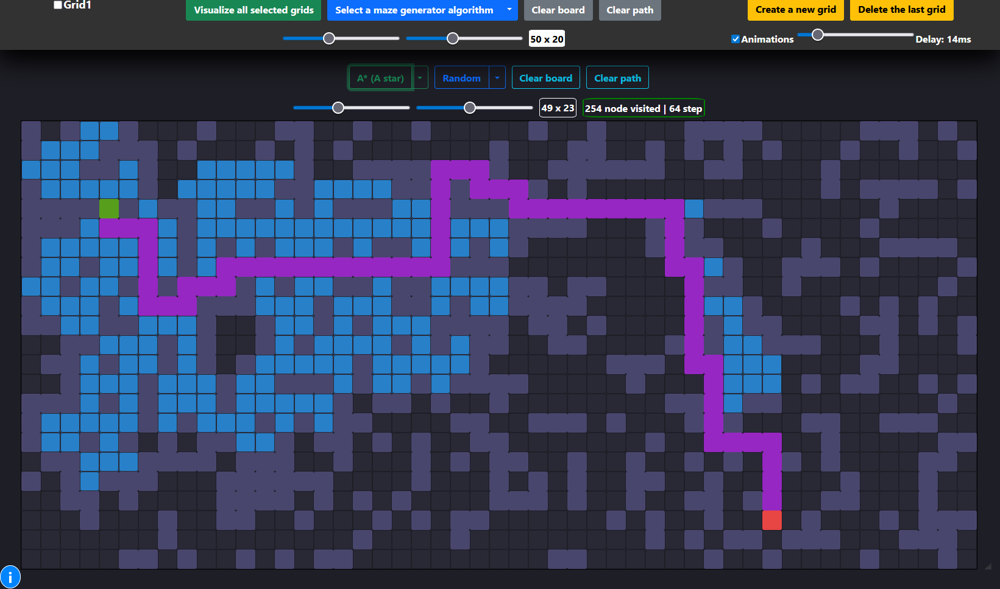
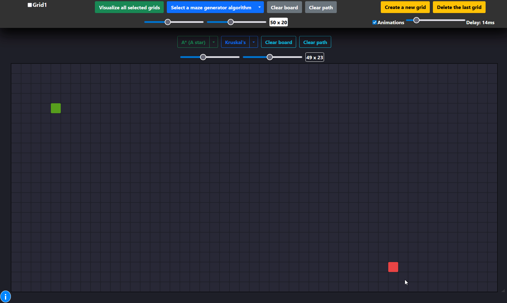

# Pathfinding Algorithm Visualizer

[](https://www.gnu.org/licenses/gpl-3.0)
[](https://developer.mozilla.org/en-US/docs/Web/JavaScript)

An interactive web application that visualizes classic pathfinding and maze generation algorithms on a dynamic grid.

### [▶️ Live Demo Here](https://kaidalisohaib.github.io/Pathfinding-Visualizer/)

---




- [Pathfinding Algorithm Visualizer](#pathfinding-algorithm-visualizer)
    - [▶️ Live Demo Here](#️-live-demo-here)
  - [About The Project](#about-the-project)
  - [Key Features](#key-features)
  - [Tech Stack](#tech-stack)
  - [Getting Started](#getting-started)
    - [Prerequisites](#prerequisites)
    - [Installation](#installation)
  - [Usage](#usage)
  - [Technical Challenges \& Lessons Learned](#technical-challenges--lessons-learned)
  - [Future Improvements](#future-improvements)
  - [License](#license)

## About The Project

Understanding graph traversal algorithms is fundamental to computer science, but theoretical knowledge can often be abstract. This Pathfinding Visualizer was built to bridge that gap, providing a hands-on tool to see exactly how these algorithms operate.

This application allows users to watch algorithms like A*, Dijkstra's, and Breadth-First Search explore a grid, navigate obstacles, and find the optimal path in real-time. You can draw walls, place weighted nodes to increase traversal "cost," and even generate complex mazes using algorithms like Kruskal's and Randomized DFS. The multi-grid interface is a unique feature that enables the simultaneous comparison of different algorithms, offering clear insights into their relative performance and behavior.

## Key Features

-   **Multiple Algorithm Visualization:** Implements a suite of pathfinding and maze generation algorithms.
    -   **Pathfinders:** A*, Dijkstra's, Breadth-First Search (BFS), Depth-First Search (DFS), Greedy BFS, and Swarm.
    -   **Maze Generators:** Randomized DFS, Randomized Walls, and Kruskal's Algorithm.
-   **Fully Interactive Grid:**
    -   Drag and drop the start and end nodes to any position.
    -   Draw walls and obstacles directly onto the grid with a simple click-and-drag.
    -   Add weighted nodes (higher cost to traverse) by holding the 'W' key while drawing.
-   **Real-time Animation Control:**
    -   Adjust the visualization speed with a delay slider for a customized learning pace.
    -   Skip animations instantly to see the final result.
-   **Dynamic Grid Configuration:** Change the grid size on the fly without reloading the page.
-   **Multi-Grid Comparison:** A powerful feature that allows you to run and compare different algorithms side-by-side on separate, synchronized grids.

## Tech Stack

This project was built from the ground up using fundamental web technologies, demonstrating strong core programming skills.

-   **Frontend:** Vanilla JavaScript (ES6+), HTML5, CSS3
-   **UI Framework:** Bootstrap 5 (for layout and components)
-   **Core Logic:**
    -   Custom-built data structures (Priority Queue, Queue, Stack) for optimal algorithm performance.
    -   DOM manipulation for dynamic grid rendering and updates.

## Getting Started

To get a local copy up and running, follow these simple steps.

### Prerequisites

All you need is a modern web browser that supports HTML5, CSS3, and JavaScript (e.g., Chrome, Firefox, Safari, Edge).

### Installation

1.  Clone the repository to your local machine:
    ```sh
    git clone https://github.com/kaidalisohaib/Pathfinding-Visualizer.git
    ```
2.  Navigate to the project directory:
    ```sh
    cd Pathfinding-Visualizer
    ```
3.  Open the `index.html` file in your web browser.

## Usage

1.  **Select an Algorithm:** Choose a pathfinding algorithm from the dropdown menu on any grid.
2.  **Customize the Grid:**
    -   Click and drag the green (start) and red (end) nodes to new positions.
    -   Click and drag your mouse across the grid to draw walls (obstacles).
    -   Hold down the `W` key while dragging to place weighted nodes, which are more "expensive" for algorithms to cross.
3.  **Visualize:** Click the algorithm's name button to start the visualization.
4.  **Generate a Maze:** Select a maze generation algorithm and click its button to create a complex maze on the grid.
5.  **Control Panel:** Use the global controls at the top to clear the board, clear paths, or run visualizations on all selected grids simultaneously.

## Technical Challenges & Lessons Learned

This project provided an excellent opportunity to tackle several interesting software engineering challenges.

1.  **Challenge: Efficient Algorithm Implementation**
    -   **Problem:** Algorithms like A* and Dijkstra's are inefficient without the correct underlying data structure. A simple array or list for managing "open" nodes would result in slow, linear-time searches for the next node to visit.
    -   **Solution:** I implemented a custom **Priority Queue** from scratch in `js/utilities/utils.js`. This data structure ensures that the node with the lowest cost (or "f score" in A*) can be retrieved in near-constant time, dramatically improving the performance of the pathfinding logic.
    -   **What I Learned:** This was a practical demonstration of how crucial data structures are to algorithmic efficiency. It solidified my understanding of heaps and priority queues and how they are applied to solve real-world optimization problems like finding the shortest path.

2.  **Challenge: Visualizing Synchronous Algorithms Asynchronously**
    -   **Problem:** The pathfinding algorithms run synchronously and find the entire path almost instantly. The challenge was to display this process step-by-step in a visually appealing, non-blocking way.
    -   **Solution:** I decoupled the algorithm's execution from its rendering. The pathfinding functions first run to completion, returning two arrays: one for all visited nodes in order, and one for the final shortest path nodes. Then, using `async/await` and a helper `sleep` function, I iterate through these arrays and apply CSS classes to the corresponding grid cells with a controllable delay. This creates a smooth animation without freezing the UI.
    -   **What I Learned:** This taught me how to manage asynchronous operations in JavaScript to create better user experiences. It also reinforced the importance of separating core logic (the algorithm) from the presentation layer (the UI updates).

3.  **Challenge: State Management for Multiple Grids**
    -   **Problem:** The application supports multiple grids, each with its own size, start/end points, walls, weights, and selected algorithm. Managing this complex state with just Vanilla JavaScript required careful organization.
    -   **Solution:** I created a centralized state object, `gridsConf`, which acts as a single source of truth. Each grid on the page has a corresponding entry in this object, storing all its unique properties. All UI event handlers read from and write to this state object, ensuring data consistency across the application.
    -   **What I Learned:** This project was an exercise in disciplined state management without a framework like React or Vue. It taught me the principles of designing a scalable frontend architecture and the importance of avoiding direct DOM manipulation for state storage.

## Future Improvements

-   **Implement More Algorithms:** Add more advanced algorithms like Bi-directional Search or Jump Point Search.
-   **Add More Maze Patterns:** Implement other maze generation techniques, such as the Recursive Division method.
-   **Save & Load Grids:** Allow users to save their custom grid layouts (walls and weights) to a file or local storage.
-   **Add Unit Tests:** Implement unit tests for the core algorithm and data structure implementations to ensure correctness and prevent regressions.
-   **Refactor to a Modern Framework:** Rebuild the project using a framework like React or Svelte to explore component-based architecture and more advanced state management solutions.

## License

Distributed under the GNU General Public License v3.0. See `LICENSE` for more information.